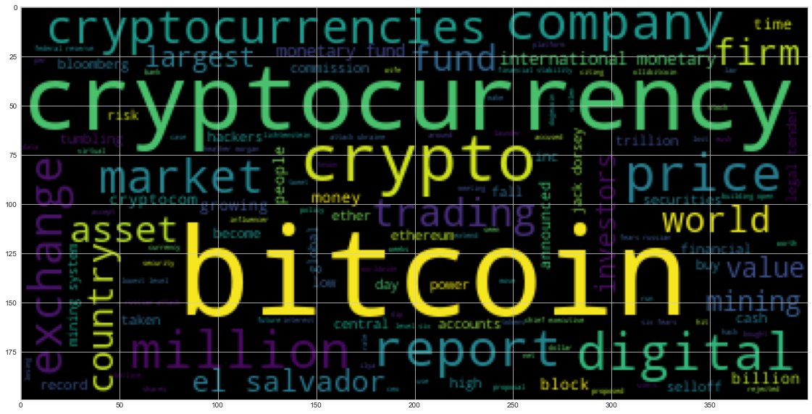
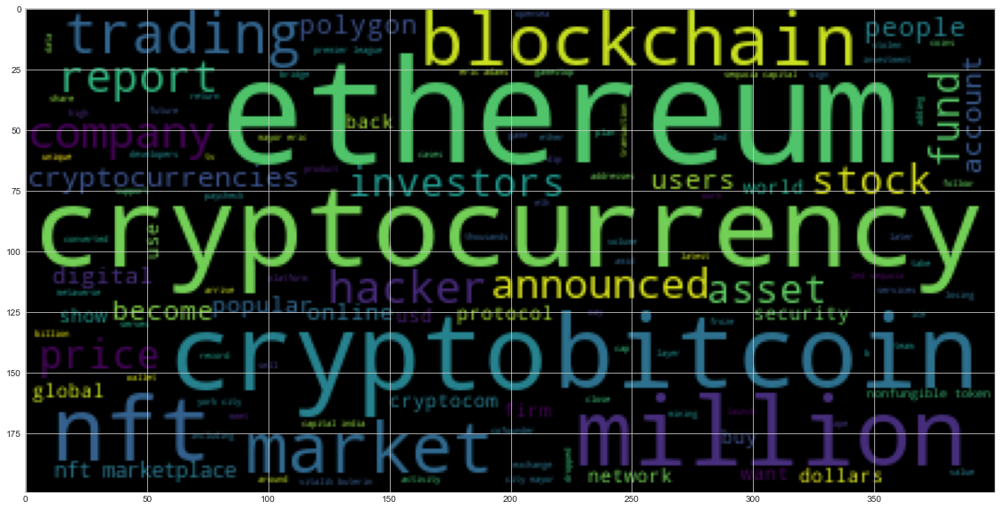
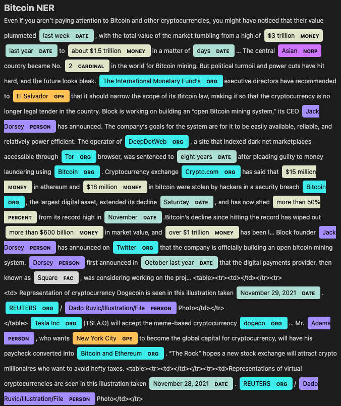
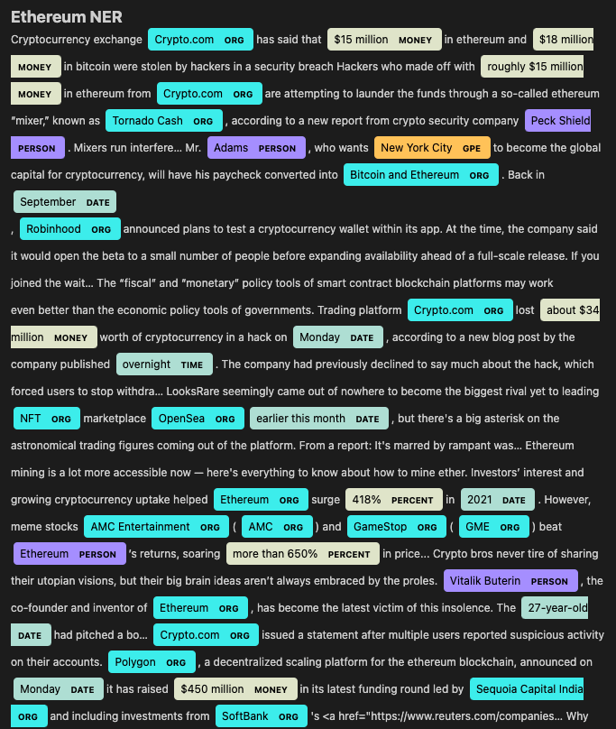

# Tales from the Crypto

## Background

There's been a lot of hype in the news lately about cryptocurrency, so we want to take stock of the latest news descriptions regarding Bitcoin and Ethereum to get a better feel for the current public sentiment around each coin.

In this assignment, I have applied natural language processing to understand the sentiment in the latest news articles featuring Bitcoin and Ethereum. I have also applied fundamental NLP techniques to better understand the other factors involved with the coin prices such as common words and phrases and organizations and entities mentioned in the articles.

## Summary

### Sentiment Analysis
Overall, sentiment towards Bitcoin and Ethereum are mixed. Bitcoin's mean compound score is -0.4 indicating a mixed negative sentiment. Ethereum's mean compound score is 0.1 indicating a slight mixed positive sentiment.

### NGrams and Frequency Analysis
Bitcoin - Top 10 frequent bigrams
1. bitcoin, mining, 6
2. international, monetary, 6
3. el, salvador, 6
4. legal, tender, 4
5. mining, system, 4
6. jack, dorsey, 4
7. heather, morgan, 4
8. six, fears, 4
9. fears, russian, 4
10. russian, attack, 4

Ethereum - Top 10 frequent bigrams
1. nft, marketplace, 6
2. york, city, 4
3. sequoia, capital , 4
4. capital, india, 4
5. nonfungible, token, 4
6. million, ethereum, 3
7. bitcoin, ethereum, 3
8. vitalik, buterin, 3
9. ethereum, blockchain, 3
10. led, sequoia, 3

### Wordclouds
Wordclouds help present the most common words throughout the texts analyzed. When working through the analysis, it is also a helpful tool for identifying frequent stopwords that are not included in NLTKs stopwords module.

### Bitcoin

### Ethereum

Complete the following tasks:

### Named Entity Recognition

